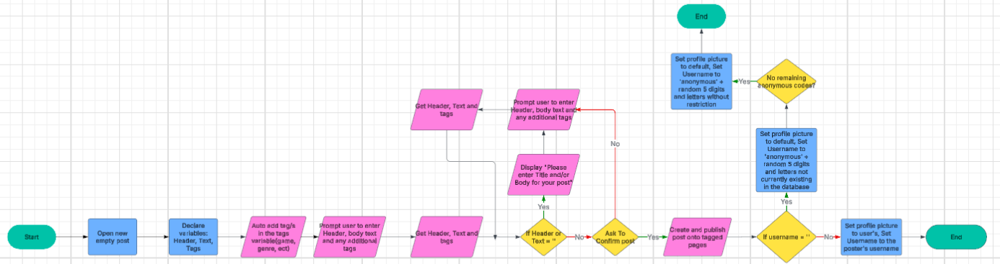

# Web-development-project
Assesment 3 10CPT FSHS

# Week one

# Developer: 
(Review social network documentation and refine/amend the social network/app Project Definition and Requirements.)

Probably too complicated - way too many functions that talk to other people (instant messaging, coding site, playing the uploaded games) so will switch to something a bit different

Probably will do something like an arcade site -> Advice on different games, arcades around based on proximity…? (might be hard to send stuff to the sites and then have that be sent back to the site again based on a location).

## Requirements definitions should include Functional (what the app will do) and Non-functional (what the app will look like and how will it perform). 

| Functional | Non-Functional |
| ----------- | ----------- |
| Tells the user tips and tricks for levels/arcade games | Should have an minimalistic but decently flashy look to it - neon colours and such, while still being easy to read (non unlike the timezone website)|
| Blogging thing? Maybe something like Quora where you ask questions and you can respond. | Performs smoothly and graphically pleasing |
| Ability to browse and navigate the site to different arcade games - ddr levels, Bishibashi levels, hammer game scores, ect | Nice loading screens, smooth transitions and no visually confusing bugs or texts |
| Can update on arcade credit sales in the area?(optional but nice to have) |  |

## Please consider the scope of the project and what is able to be offered within the timeframe - Mr Clark will be talk you through this aspect of the project.

- Make sure that priorities are in check -> the actual purpose of the site is to inform the user on tips and tricks to beat/achive good scores on arcade games.
- Need multiple different pages with unique purposes.

# Client: 
(Developer presents their understanding of the project and talk through whether the project is achievable and issues with the scope.)

## Notes as the developer on client feedback
- UI and UX are good and should be implemented well
- Coding and implementing needs time to be implemented -> needs to save lots of time for that
- No negative feeback, just need more reseaching about proximity based information
- Everything is clear and answered to a satisfactory level

### ACTION ITEMS
- Decide the colour sceme -> neon/bright or pop colours (Due by 1/08)
- Research ab/ goals of the site (code, incoperating difficult/complicated aspects of the site) -> look at similar sites for inspiration (1/08)

## Retrospecitve Client meeting (As the Client)
Waiting on the developer.

|||
| ----------- | ----------- |
| Date | 28/07/2025 |
| Meeting Facilitator | Joshua |
| Purpose | To clarify the Functional (what the app will do) and Non-functional (what the app will look like and how will it perform) aspects of the website. |
| Attendees | Boris, Joshua |
| Topics | Talking through whether the project is achievable and issues with the scope. |

### Overview
- Doordash clone but for tools
- Homepage, reccomended specials, ect
- Multiple suppliers
- Search page
- Comparison lol (optional, trying to implementing late)
- Filters by
- Basket
- Pay (form, using paypal ect)
- Settings for login and accounts
- Edict account
- history 
- View order history and delivery
- browsing is easy and intuitive
- pay by card and see esimated delivery time

- sub 3 secs to load
- Can handle many users at one time
- secure information(if enough time)
- All things are intiutive
- Search can detect slight errors and correct them without issue
- No bugs or errors

### Discussion

| What Went Well? | What Needs To Change? | What needs to be answered? |
| ----------- | ----------- | ----------- |
| Clear understanding | A VERY ambitious, many many features | Everything was clear and well answered |
| Clear goals | Tone down/take out some of the features | UI placements |
| Knows what needs to be done and what not to do | A high amount of goals |  |

### Action Items
| Action Item | Person Responsible | Due Date |
| ----------- | ----------- | ----------- |
| Research of complicated features | Boris | next friday(next next meeting) |

### Risks to Project 
- Ambitious and can run out of time when done (Search Feature, History, Login, comparing prices)

### Summary
Client has a very clear idea and passionate about what to do. The scope is extremely ambitious, and the features are hard to do.

# Week 2
Sketch out the wireframe of your web apps UI - it doesn’t have to be exact - this is just a sketch or plan - you may use Figma or other tool if this is easier.

When designing, consider the following:
- Navigation
- Branding
- Forms
- Buttons
- Any other interactive elements
- Annotate your sketch and outline how your app should work. Taking notes will help you clarify and understand why you’ve designed certain elements at a later stage. 

Make sure to consider what choices you are going to make in terms of COLOUR PALETTE,  TYPOGRAPHY and IMAGE/ICON CHOICE. Indicate to your client this week the main sets of choices you are going to make in these areas - collate them into ta table in your VSCode README.MD.

 ## Summary

Wireframe that I added was a home page, a games page as well as a settings page.
| Problem/neccesity | Implemented Solution |
|-------------|-------------|
| Navigation | My navigation bar remained at the top the entire time, even when scrolling down to ensure ease of access to other parts of the site |
| Branding | The branding is subtle but always present - the logo on the top left, and the name of the site always present as well |
| Form | The form of the website is well spaced and natural to ensure no cluttering and ease on the eyes while still having a good popping colour, neon purple, red, aqua and yellow. |
| Buttons | Buttons are obvious and clear, being large enough with a "Read More" in order to clear confusion and enusure they know that the button does. |
| Colour Palette | Colour Palette is a clash of Neon purple, Yellow, Aqua and Red to help bring out the text while having an arcade like feel the site to give a sence of farmiliarity to the arcade gamers. |
| Typography | The Typography of the site has both an 8-bit text for sub-headings, things that need to be stand out as, while a larger all caps font for main titles and catchphrases. The usual font is a smaller but easy to read font that allows the colour to pop, and the font to allow ease of reading |
| Icons/Images | Images are not fully implemented but are all standout with colours related to the colour scheme, while representing what I want them to. They all are peppered across the site, all giving 'headings' or flavour site. |

Annotations are in the images in the folder named "Wireframe Images"

# Week 3
## Summary

Creating an alternative wireframe for the website with different ideas on the layout of the UI, typography, and colour schemes.

| Problem/neccesity | Implemented Solution |
|-------------|-------------|
| Navigation | Has an icon that has a menu that pops up on the side of the website, shading the rest of the site|
| Branding | Logo remains the same. |
| Form | Lots of Negative space on the homepage, with good uses of icons to give engagement. Made sure the website does not feel cluttered. |
| Buttons | Interactive and clear when given. Icons, buttons, as well as the interactive arcade cabinet. |
| Colour Palette | Kept mainly the same. Removed the Blues, Reds and Yellows and using whites and blacks instead. |
| Typography | More of a neon coloured and text based feel to the site, with the titles and sub-headings being Trend-Sans-Five, a type of text that glows and is bubble text. |
| Icons/Images | Icons are plentiful in the side menu, and gives clear indication onto what the page you are going to will be. The images are sparce but are used effectively. |

Annotations are in the images (contained in the folder "Alternate Wireframe Images".)

# Week 4
## Summary

- Design an algorithm for one functional component of your web application. MAKE SURE your algorithm is a STEP BY STEP outline of how input is processed/checked/stored by the system and produces an output. (Functional components examples - web messaging system, login screen functionality, events posting, commenting on posts etc.)

- Design 2 test cases to discuss with your client - see "Test Case Template & Example" in the web link below entitled "HOw to create Test Cases" - you do not need to complete the ACTUAL RESULT and PASS/FAIL component at this stage

## Algorithm

Additionally, Screenshot is inside the folder (titled Algorithm Flowchart)
Alternatively, a link is provided [here](https://lucid.app/lucidchart/1d758ea7-eb07-4b87-8ffa-745b4da0a66d/edit?viewport_loc=607%2C-466%2C3208%2C1596%2C0_0&invitationId=inv_e37ebfca-70cc-4aa6-82f5-8f6ce041c6e8)

## Test cases

| Test case ID | Test case name | Preconditions | Test steps | Expected result | Actual Result | Pass/Fail | Priority |
|-------------|-------------|-------------|-------------|-------------|-------------|-------------|-------------|
| TC001 | Verify User Login | User must have a registered account | Open the application -> Enter a valid username and password -> Click the 'Login' button | User will be able to sucessfully log in to their account |  |  | High |
| TC002 | Confirm searching works | N/A | Open the application -> Enter key words/game and/or genre -> wait until site loads | Specified game and/or genre of games should pop up |  |  | medium |

# Week 5

- Went through the tutorial and completed it word for word
- Created a UserInformation 
- Fixed all of the bugs, and added the right folders
- Added the HTML opperational, and can added the backend
- CSS is not currently working

# Week 6
- Readjusted folders and files so the code links and opperates correctly
- Starting to change into target website
- added a bunch of SQL tables for later uses

# Week 7 
- added new pages and images
- Making home page from template
- inserted information into SQL
- Added more stuff to pages

# Week 8
- Created about me page
- Created a filter and dropdown menu for the games based of SQL information

# Week 9
- Created a not funtional reset password
- Created and polished login pages
- added a bunch of SQL data

# Week 10
- Created, fixed and confirmed login works
- Created a blogging area where logged in users can post
- Added a liking system for the posts
- Changed Nav so that it changes if you're logged in/not logged in.

# Week 1(T4)
- Fixed minor stuff -> CSS styling, looks.
- testing for bugs